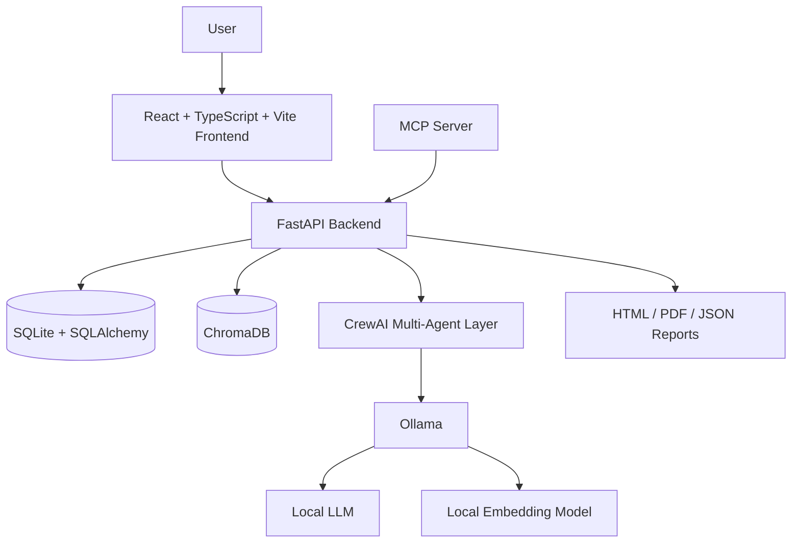

# 🚀 Resume Analyser

### Privacy-First AI Resume & ATS Analysis Platform

**Resume Analyser** is a local-first AI-powered platform designed to help job seekers understand, evaluate, and improve their resumes against target job descriptions.

It combines **deterministic ATS scoring**, **local LLMs**, **multi-agent AI orchestration**, **resume parsing**, **LinkedIn profile comparison**, and **local job opportunity matching** into a single platform.

> 🔒 **Privacy First:** Resume, LinkedIn, and job data are processed locally. The application is designed to work without sending personal career data to external AI or job-search APIs.

---

## ✨ Why Resume Analyser?

Most resume analysis tools send your resume to third-party cloud services and provide a single unexplained score.

Resume Analyser takes a different approach.

It provides:

* 📊 Transparent ATS Readiness scoring
* 🤖 Local AI analysis using Ollama
* 🧠 Multi-agent processing using CrewAI
* 🔍 Evidence-backed recommendations
* 💼 Resume-to-job matching
* 🔗 Resume vs LinkedIn consistency analysis
* 📄 PDF/DOCX/TXT resume processing
* 🔐 Local data storage
* 🔌 MCP server integration
* 🐳 Docker-based deployment

The goal is not simply to give you a score, but to explain **why** the score was generated and **what you can improve**.

---

# 🎯 Core Features

## 📄 1. Resume Analysis

Upload your resume in supported formats:

* PDF
* DOCX
* TXT

The system extracts information such as:

* Contact information
* Professional summary
* Skills
* Work experience
* Education
* Certifications
* Projects
* Achievements
* Job titles
* Companies
* Dates
* Keywords
* Resume bullet points

It also identifies potential ATS parsing risks such as:

* Multi-column layouts
* Tables
* Images containing text
* Unusual section headings
* Excessive graphics
* Missing standard sections
* Unsupported formatting

---

## 📊 2. ATS Readiness Estimate

Resume Analyser uses a **transparent deterministic scoring system** rather than relying entirely on an LLM to generate a score.

### Score Breakdown

| Category                           |  Weight |
| ---------------------------------- | ------: |
| ATS-safe formatting & parseability |      20 |
| Standard resume sections           |      10 |
| Contact & profile completeness     |       5 |
| Job keyword coverage               |      25 |
| Experience & skill alignment       |      15 |
| Achievement & quantified impact    |      10 |
| Readability & bullet quality       |      10 |
| Resume/LinkedIn consistency        |       5 |
| **Total**                          | **100** |

Two analysis modes are supported:

**General ATS Readiness Estimate**

Used when no target job description is provided.

**Job-Specific ATS Readiness Estimate**

Used when a target job description is provided.

> ⚠️ The score is an estimate, not a proprietary ATS score. Different Applicant Tracking Systems use different algorithms and configurations.

---

# 🎯 3. Job-Specific Resume Matching

Paste or upload a target job description and analyze how closely your resume aligns with it.

The system identifies:

* Matching keywords
* Missing keywords
* Matching skills
* Missing skills
* Relevant experience
* Resume-job alignment
* Potential ATS risks
* Evidence supporting the analysis

Recommendations are linked back to the relevant job description and resume evidence wherever possible.

---

# 🔗 4. LinkedIn Profile Analysis

Resume Analyser can compare your resume with **user-provided LinkedIn data**.

Supported sources include:

* LinkedIn profile PDF
* Exported LinkedIn data
* Pasted LinkedIn profile text
* Other locally provided profile information

The system can identify:

* Job title inconsistencies
* Date inconsistencies
* Missing skills
* Missing projects
* Different employer names
* Summary/branding differences
* Resume vs LinkedIn skill gaps

### Important LinkedIn Limitation

A LinkedIn URL or LinkedIn ID **cannot be used to automatically scan a LinkedIn profile**.

The application does **not** scrape LinkedIn or bypass LinkedIn authentication.

If only a LinkedIn URL/ID is provided, it is stored as an identifier and the application will clearly indicate that profile content cannot be analyzed until the user provides the actual profile data.

---

# 💼 5. Opportunity Matcher

Resume Analyser does not scrape job websites or retrieve jobs from external job APIs.

Instead, you can import your own local job data from:

* CSV
* JSON
* TXT
* PDF
* Pasted job descriptions
* User-exported LinkedIn job data

The system ranks opportunities using a hybrid local matching approach:

1. Exact keyword overlap
2. Skill normalization
3. Explicit experience/date comparison
4. Local Ollama embeddings
5. BM25 lexical ranking
6. Deterministic weighted ranking

Each opportunity can display:

* Job title
* Company
* Location
* Match score
* Matched skills
* Missing requirements
* Resume evidence
* LinkedIn evidence
* Match explanation
* Confidence level

> The system reports **potential matches and skills overlap** rather than claiming that a candidate is guaranteed to be qualified or hired.

---

# 🤖 6. Multi-Agent AI Architecture

The project uses **CrewAI** for local multi-agent orchestration.

The architecture is designed around specialized agents:

### 1. Document Intake Agent

Validates uploaded files, extracts text and metadata, and creates structured document records.

### 2. Resume Structure Agent

Analyzes resume sections, formatting, skills, experience, education, and bullet points.

### 3. LinkedIn Reconciliation Agent

Compares user-provided LinkedIn information with resume information and identifies inconsistencies.

### 4. ATS Analysis Agent

Explains deterministic ATS score results using the supplied evidence.

### 5. Recommendation Agent

Generates actionable, evidence-based recommendations.

### 6. Opportunity Matching Agent

Explains why locally imported job opportunities match the user's profile.

### 7. Quality & Provenance Verifier

Validates generated results and checks for unsupported claims and missing evidence.

---

# 🧠 Local AI Stack

The AI layer is designed to run locally using **Ollama**.

Recommended configurable models include:

* `qwen2.5:7b`
* `qwen2.5:14b`
* `llama3.1:8b`
* `mistral-nemo`

For embeddings:

* `nomic-embed-text`
* `bge-m3`

Models can be configured through environment variables.

---

# 🔐 Privacy & Security

Privacy is one of the core design principles of the project.

The platform is designed to:

* Store uploaded files locally
* Avoid sending resumes to third-party AI services
* Avoid external job APIs
* Avoid LinkedIn scraping
* Disable telemetry where possible
* Avoid logging raw resume content
* Redact sensitive information from logs
* Support user data deletion
* Validate uploaded files
* Detect duplicate documents using hashes
* Apply local authentication
* Restrict MCP access
* Prevent unsupported claims from being presented as facts

The application is intended to continue operating after the required dependencies and Ollama models have been installed, without requiring external AI APIs.

---

# 🧾 Evidence & Provenance

A major feature of Resume Analyser is its **evidence-first architecture**.

AI-generated conclusions are intended to be grounded in locally supplied sources such as:

* Resume
* LinkedIn export
* LinkedIn PDF
* Pasted profile information
* Job descriptions
* Imported job datasets

Extracted information can be associated with:

```text
source_type
source_file_name
page_number
source_excerpt
confidence
timestamp
document_hash
```

This allows the system to distinguish between:

* **Extracted Fact**
* **Inference**
* **Recommendation**
* **Draft Suggestion**
* **Not Found in Uploaded Documents**
* **Low Confidence**

The system is explicitly designed to avoid inventing:

* Skills
* Employers
* Job titles
* Certifications
* Metrics
* Salary information
* Years of experience
* Job listings
* Qualifications

---

# 🏗️ Architecture



The repository follows a monorepo structure with separate frontend, backend, MCP, documentation, and deployment components.

---

# 🛠️ Tech Stack

## Frontend

* React 18
* TypeScript
* Vite
* Tailwind CSS
* React Router
* Axios
* TanStack React Query
* Recharts
* React Dropzone
* Lucide React
* Vitest

The frontend package configuration confirms React, TypeScript, Vite, Tailwind CSS, React Query, Recharts, and related tooling.

## Backend

* Python
* FastAPI
* Uvicorn
* SQLAlchemy
* Alembic
* SQLite
* Pydantic
* PyMuPDF
* python-docx
* Tesseract OCR
* Pillow
* CrewAI
* Ollama
* ChromaDB
* BM25
* Jinja2
* WeasyPrint
* Pytest

These dependencies are defined in the project's backend requirements.

## AI

* Ollama
* CrewAI
* Local LLMs
* Local embeddings
* ChromaDB
* BM25

## MCP

* Model Context Protocol
* Python MCP SDK
* FastAPI
* Uvicorn

The MCP server exposes a local interface for interacting with Resume Analyser functionality.

## Infrastructure

* Docker
* Docker Compose
* Nginx
* SQLite
* ChromaDB
* Ollama

The Docker Compose setup includes dedicated services for Ollama, ChromaDB, FastAPI backend, MCP server, and React frontend.

---

# 📁 Project Structure

```text
resume_analyser/
│
├── backend/
│   ├── alembic/
│   ├── app/
│   │   ├── agents/
│   │   ├── api/
│   │   ├── core/
│   │   ├── db/
│   │   ├── models/
│   │   ├── services/
│   │   └── main.py
│   │
│   ├── Dockerfile
│   ├── alembic.ini
│   ├── pyproject.toml
│   └── requirements.txt
│
├── frontend/
│   ├── src/
│   ├── public/
│   ├── Dockerfile
│   ├── package.json
│   ├── nginx.conf
│   ├── tailwind.config.js
│   ├── tsconfig.json
│   └── vite.config.ts
│
├── mcp_server/
│   ├── app/
│   ├── Dockerfile
│   └── requirements.txt
│
├── docs/
│
├── scripts/
│
├── docker-compose.yml
├── .env.example
├── project.md
└── README.md
```

---

# ⚙️ Installation

## Prerequisites

Make sure you have installed:

* Git
* Docker Desktop
* Docker Compose
* Ollama

For local development without Docker, also install:

* Python 3.11+
* Node.js 18+
* npm

---

# 🚀 Quick Start with Docker

### 1. Clone the repository

```bash
git clone https://github.com/adarshsharma020101/resume_analyser.git

cd resume_analyser
```

### 2. Create your environment file

```bash
cp .env.example .env
```

On Windows PowerShell:

```powershell
Copy-Item .env.example .env
```

Update the environment variables if required.

---

### 3. Start the application

```bash
docker compose up --build
```

Docker Compose starts:

* Ollama
* Ollama model initialization
* ChromaDB
* FastAPI backend
* MCP server
* React frontend

The repository's Compose configuration exposes the frontend on localhost port `3000`, the backend on `8000`, the MCP server on `8001`, and Ollama on `11434`.

---

# 🌐 Application URLs

After starting the containers:

| Service     | URL                        |
| ----------- | -------------------------- |
| Frontend    | http://localhost:3000      |
| Backend API | http://localhost:8000      |
| API Docs    | http://localhost:8000/docs |
| MCP Server  | http://localhost:8001      |
| Ollama      | http://localhost:11434     |
| ChromaDB    | http://localhost:8002      |

> These services are configured for localhost access by default.

---

# 🧠 Ollama Models

The default Docker configuration uses:

```text
qwen2.5:7b
```

and:

```text
nomic-embed-text
```

You can change the models through environment variables:

```env
OLLAMA_LLM_MODEL=qwen2.5:7b
OLLAMA_EMBED_MODEL=nomic-embed-text
```

For example:

```bash
ollama pull qwen2.5:7b
ollama pull nomic-embed-text
```

If your machine has limited GPU memory, use a smaller model appropriate for your hardware.

---

# 💻 Local Development

## Backend

```bash
cd backend
```

Create a virtual environment:

```bash
python -m venv .venv
```

### Windows

```powershell
.venv\Scripts\activate
```

### Linux/macOS

```bash
source .venv/bin/activate
```

Install dependencies:

```bash
pip install -r requirements.txt
```

Run database migrations:

```bash
alembic upgrade head
```

Start FastAPI:

```bash
uvicorn app.main:app --reload
```

Backend:

```text
http://localhost:8000
```

---

# 🎨 Frontend Development

```bash
cd frontend
```

Install dependencies:

```bash
npm install
```

Start the Vite development server:

```bash
npm run dev
```

Build for production:

```bash
npm run build
```

Run tests:

```bash
npm test
```

Lint the project:

```bash
npm run lint
```

---

# 🔌 MCP Server

Resume Analyser includes a dedicated MCP server that allows MCP-compatible clients to interact with the local platform.

The project is designed to support operations such as:

* Upload resume
* Add LinkedIn identifier
* Upload LinkedIn profile
* Analyze profile
* Add job description
* Import jobs
* Match opportunities
* Generate reports
* Delete user data
* Retrieve provenance

The MCP architecture is designed around structured responses and local-only access.

---

# 🧩 MCP Example

A compatible MCP client can be configured to connect to the local MCP server.

Example HTTP endpoint:

```text
http://localhost:8001
```

For local desktop MCP clients, the project can also be configured for stdio-based MCP communication where supported.

> Authentication should be configured before exposing MCP over a network.

---

# 📊 Example Workflow

```text
1. Upload Resume
        ↓
2. Extract & Validate Document
        ↓
3. Build Evidence Packet
        ↓
4. Parse Resume Structure
        ↓
5. Add Job Description
        ↓
6. Calculate Deterministic ATS Score
        ↓
7. Run Local AI Analysis
        ↓
8. Generate Recommendations
        ↓
9. Verify Evidence & Provenance
        ↓
10. Display Results
        ↓
11. Export Report
```

---

# 📑 Reports

Analysis results can be generated in:

* JSON
* HTML
* PDF

Reports are designed to contain:

* ATS readiness estimate
* Score breakdown
* Resume parsing findings
* Keyword analysis
* Recommendations
* Evidence references
* Confidence levels
* Provenance information

---

# 🛡️ Responsible AI & Truthfulness

Resume Analyser intentionally avoids making claims such as:

❌ "You will get an interview."

❌ "You are guaranteed to qualify."

❌ "This is your exact ATS score."

❌ "LinkedIn was scanned from your profile URL."

❌ "This job is guaranteed to be a good match."

Instead, the system uses language such as:

✅ "ATS Readiness Estimate"

✅ "Potential Match"

✅ "Strong Skills Overlap"

✅ "Requirements Partially Covered"

✅ "Not Found in Uploaded Documents"

This helps keep AI-generated career guidance grounded in the user's actual data.

---

# 🔒 Data Privacy

Resume and career information can contain highly sensitive personal information.

Resume Analyser is designed around a **local-first architecture**:

```text
Your Resume
     ↓
Local Application
     ↓
Local Database
     ↓
Local AI Models
     ↓
Local Analysis
```

No cloud AI provider is required for the core AI workflow.

The project specification explicitly prohibits using external AI APIs, external job APIs, LinkedIn APIs, web scraping, and runtime outbound network requests for the core application.

---

# 🧪 Testing

Backend tests can be executed with:

```bash
cd backend
pytest
```

With coverage:

```bash
pytest --cov
```

Frontend tests:

```bash
cd frontend
npm test
```

---

# 🐳 Docker Services

The Docker Compose deployment consists of:

```text
┌─────────────────────────────┐
│          Frontend           │
│       React + Nginx         │
│        localhost:3000       │
└──────────────┬──────────────┘
               │
               ▼
┌─────────────────────────────┐
│          Backend            │
│          FastAPI            │
│        localhost:8000       │
└───────┬───────────┬─────────┘
        │           │
        ▼           ▼
┌─────────────┐ ┌─────────────┐
│  ChromaDB   │ │   Ollama    │
│  localhost  │ │  localhost  │
│    :8002    │ │    :11434   │
└─────────────┘ └──────┬──────┘
                       │
                       ▼
                Local LLM + Embeddings

               ┌─────────────┐
               │ MCP Server  │
               │ :8001       │
               └─────────────┘
```

---

# 🗺️ Roadmap

Planned/improvable areas include:

* [ ] Better resume parsing for complex layouts
* [ ] Additional local embedding models
* [ ] Improved ATS scoring configuration
* [ ] More robust provenance visualization
* [ ] Advanced job matching
* [ ] More MCP client integrations
* [ ] Better report templates
* [ ] More automated integration tests
* [ ] Improved accessibility
* [ ] Resume optimization workflow
* [ ] Additional local job-data import formats

---

# ⚠️ Limitations

### LinkedIn

The application cannot analyze a LinkedIn profile from a URL or ID alone.

Actual profile data must be supplied by the user.

### ATS Scores

ATS scores are estimates. Real ATS systems differ in their parsing and ranking algorithms.

### Job Opportunities

The application does not provide live job listings.

Opportunity matching is performed against user-provided/imported job data.

### AI Recommendations

AI-generated recommendations should be reviewed by the user before being added to a resume.

In particular, generated bullet points are **draft suggestions** and should be verified for factual accuracy.

---

# 🤝 Contributing

Contributions are welcome.

### 1. Fork the repository

```bash
git fork https://github.com/adarshsharma020101/resume_analyser
```

### 2. Create a branch

```bash
git checkout -b feature/your-feature
```

### 3. Make your changes

### 4. Run tests

```bash
pytest
```

and/or:

```bash
npm test
```

### 5. Commit your changes

```bash
git commit -m "feat: add your feature"
```

### 6. Push your branch

```bash
git push origin feature/your-feature
```

### 7. Open a Pull Request

---

# 📜 License

This project is currently provided for educational and development purposes.

Check the repository for the latest licensing information before redistributing or using the project commercially.

---

# 👨‍💻 Author

**Adarsh Sharma**

B.Tech CSE (AI/ML)
Interested in:

* Artificial Intelligence
* Generative AI
* Machine Learning
* AI Agents
* RAG
* Full-Stack Development
* Local LLM Applications

---

# ⭐ Support the Project

If you find this project useful:

⭐ Star the repository

🐛 Report bugs through Issues

💡 Suggest improvements

🤝 Contribute to the project

📢 Share it with other developers

---

## 🔗 Repository

**GitHub:**
https://github.com/adarshsharma020101/resume_analyser

---

### Built with ❤️ using Python, FastAPI, React, TypeScript, CrewAI, Ollama, ChromaDB and Docker.
